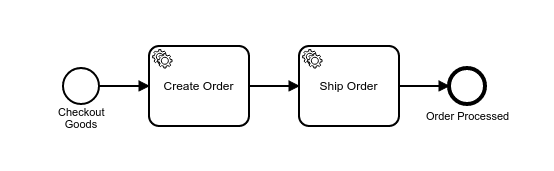
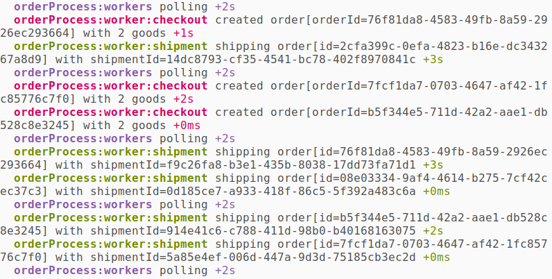

# camunda-worker-node Example

This example shows how to automate a simple [order process](./orderProcess.bpmn) using [Camunda](https://camunda.com), [external tasks](https://docs.camunda.org/manual/latest/user-guide/process-engine/external-tasks/) and [camunda-worker-node](https://github.com/nikku/camunda-worker-node).

## About

The following process is the basis of this example:



It defines two external tasks, `orderProcess:checkout` and `orderProcess:shipment`.

The script [`index.js`](./index.js) bootstraps [camunda-worker-node](https://github.com/nikku/camunda-worker-node) and hooks in the (external) implementation for both.


Upon execution the workers log the work the perform.




## Usage

Deploy the process:

```bash
npm run support:deploy
```

Start 1000 process instances:

```bash
npm run support:start-process -- --stream
```

Start workers:

```bash
npm run start-workers
```


## LICENSE

MIT